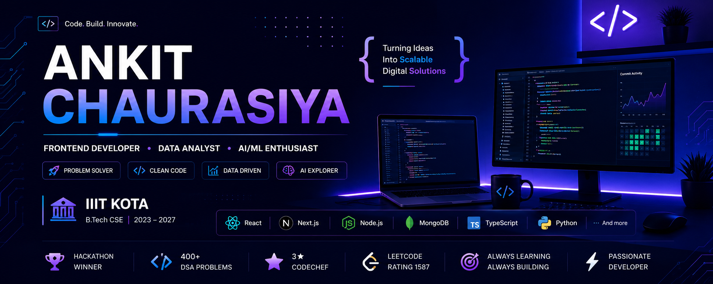

  

# 👋 Hi, I'm Ankit Chaurasiya

---

## 🚀 About Me

🎓 B.Tech in Computer Science & Engineering @ **IIIT Kota (2023–2027)**

💼 Frontend Developer Intern @ **Newgen Software**

🏆 Hackathon Enthusiast & Competitive Programmer

🌱 Currently exploring

- Next.js
- System Design
- AI Applications
- Backend Architecture

💡 Interested in

- Full Stack Development
- Artificial Intelligence
- Data Analytics
- Scalable Web Applications

---

## 🌐 Connect With Me

---

# 💻 Tech Stack

### Languages

### Frontend

### Backend

### Tools

---

# 🚀 Featured Projects

<table>
<tr>

<td width="50%">

## 💰 BillBuddy

### AI-Powered Expense Splitting Platform

### ✨ Features

- 🤖 AI-powered spending insights
- 💸 Smart debt simplification
- 👥 Group expense management
- 🔐 Clerk Authentication
- 📧 Automated reminders
- 📊 Expense analytics

### 🛠 Tech Stack

Next.js • React.js • Tailwind CSS • Convex • Clerk • Gemini AI

</td>

<td width="50%">

## 🌿 AyurVision

### AI-Powered Healthcare Analysis Platform

### ✨ Features

- 🧠 AI Disease Detection
- 📷 Image Upload
- 👨‍⚕️ Patient Dashboard
- 🩺 Specialist Dashboard
- 📊 AI Reports
- 🌱 Ayurvedic Recommendations

### 🛠 Tech Stack

React • Node.js • Express • MongoDB • TensorFlow.js • OpenAI API

</td>

</tr>
</table>

---

# 💼 Experience

## 🏢 Frontend Developer Intern

### Newgen Software

📍 Noida, India

📅 June 2025 – August 2025

- Developed scalable React.js interfaces.
- Built reusable UI components.
- Improved application responsiveness.
- Collaborated with backend and UI/UX teams.
- Worked on production-ready enterprise applications.

---

# 🏆 Achievements

🥈 1st Runner-Up — IIT Jodhpur DevQuest 2025

🏅 Top 10 — Hack the Chain 2.0

🥇 1st Rank — Byte Break 2.0

💼 Frontend Developer Intern — Newgen Software

⭐ 400+ DSA Problems Solved

⭐ 3★ CodeChef

⭐ LeetCode Max Rating: **1587**

---

# 📊 GitHub Analytics

---

# 🏆 GitHub Trophies

---

# 📈 Contribution Graph

---

## 👀 Profile Views

## 🐍 Contribution Snake

## 📊 Coding Activity

# 💻 Competitive Programming

| Platform | Profile |
|----------|---------|
| 🟠 LeetCode | https://leetcode.com/u/Ankit_IIITKota/ |
| ⭐ CodeChef | https://www.codechef.com/users/ankit_2907 |
| 🔵 Codeforces | https://codeforces.com/profile/Ankit_IIITKota |

# 🌱 Currently Working On

- 🚀 Building AI-powered Full Stack Applications

- 📊 Learning Advanced System Design

- 🤖 Exploring Generative AI

- ⚡ Improving DSA & Competitive Programming

- 💼 Preparing for Software Engineering Roles

## 💡 Developer Quote

> "First, solve the problem. Then, write the code." — Ankit Chaurasiya

## 🏆 GitHub Trophies

## 📈 Contribution Graph

